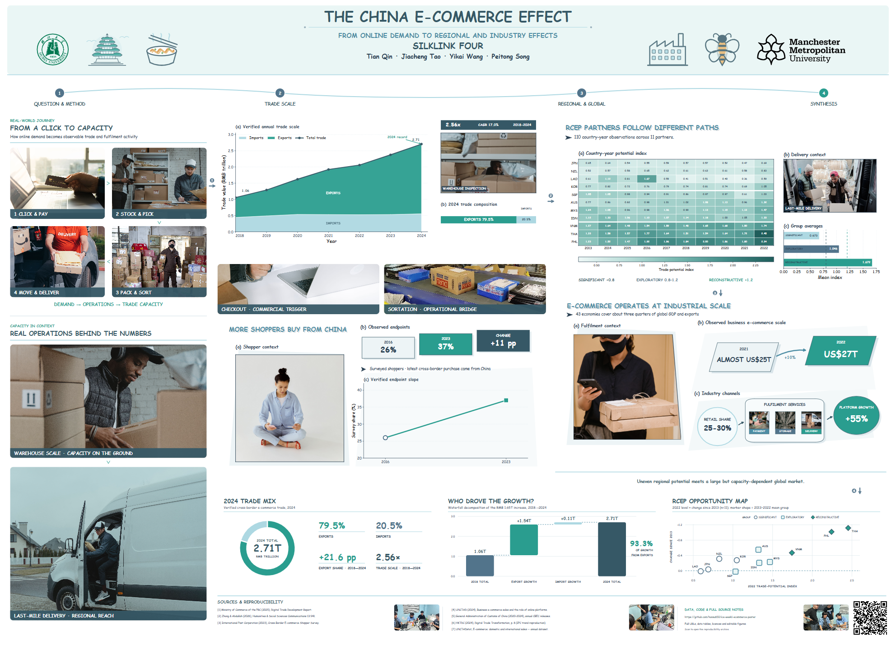

# ICE Week 1: E-commerce Trends Poster

[](https://github.com/hansu650/ice-week1-ecommerce-poster/actions/workflows/data-validation.yml)
[](https://github.com/hansu650/ice-week1-ecommerce-poster/actions/workflows/poster-validation.yml)

This public repository records the research evidence, deterministic data processing, team handoff, poster integration, and final delivery for Week 1 of Industry and Community Engagement.

## Final poster

[](poster/final/W1_Layout_A_Integrated_Final_4960.pdf)

**The China E-Commerce Effect: From Online Demand to Regional and Industry Effects**

- [Download the editable SVG master](poster/final/W1_Layout_A_Integrated_Final_4960.svg)
- [Download the print PDF](poster/final/W1_Layout_A_Integrated_Final_4960.pdf)
- [Read the poster delivery notes](poster/README.md)
- [Read the complete public process and evidence chain](docs/FINAL_POSTER_PROCESS.md)

The final canvas is 4960 × 3600 units. The SVG is the canonical editable master; the PDF is the large-format print/viewing version. The poster combines vector evidence modules with attributed raster photographs, so “SVG master” does not mean that every embedded source asset is itself vector artwork.

## Current status

- Four team evidence modules are integrated into one four-stage argument.
- The final SVG, PDF, and review preview are committed under [`poster/final/`](poster/final/).
- Project-specific validation records 35/35 checks as passing.
- QR verification records four successful decode contexts: standalone, full-resolution poster, 40% review preview, and a 150-DPI PDF render.
- The earlier data pipeline remains deterministic and is checked by GitHub Actions.

## Evidence chain

```text
official reports and documented source scope
  -> provenance-preserving raw inputs
  -> deterministic preparation and validation scripts
  -> teammate-ready processed tables and metrics
  -> four independently developed evidence modules
  -> three structured mini-figure review rounds
  -> multi-version poster integration and feedback fixes
  -> final SVG/PDF + manifest + validation + QR report
  -> repository-level checksum and delivery checks
```

The public-safe process narrative is in [`docs/FINAL_POSTER_PROCESS.md`](docs/FINAL_POSTER_PROCESS.md). It distinguishes direct evidence, design decisions, limitations, and claims that should not be made.

## Verified data streams

| Module | Processed file | Rows | Important scope |
|---|---|---:|---|
| Market growth | [`data/processed/china_cbec_trade_2018_2024.csv`](data/processed/china_cbec_trade_2018_2024.csv) | 7 | Revised 2018–2024 series; unit is RMB 100 million |
| Consumer reach | [`data/processed/ipc_purchase_source_china_2016_2023.csv`](data/processed/ipc_purchase_source_china_2016_2023.csv) | 2 | Two observed survey endpoints; not a sales-value market share |
| Global industry context | [`data/processed/unctad_business_ecommerce_sales_2016_2022.csv`](data/processed/unctad_business_ecommerce_sales_2016_2022.csv) | 7 | Approximate totals for 43 economies; 2022 is indicative |

Machine-readable derived metrics are in [`data/processed/metrics_summary.json`](data/processed/metrics_summary.json). Definitions, provenance, and limitations are documented in [DATA_DICTIONARY.md](DATA_DICTIONARY.md) and [DATA_SOURCES.md](DATA_SOURCES.md).

Key interpretation boundaries retained in the poster process:

- the verified 2024 China cross-border e-commerce total is approximately RMB 2.71 trillion;
- the IPC 26% → 37% endpoints describe surveyed shoppers whose latest cross-border purchase came from China, not China’s global sales share;
- the RCEP evidence is framed as opportunity/association rather than a direct causal estimate;
- the 2022 UNCTAD business e-commerce total remains indicative.

## Rebuild and validate the data

```bash
conda env create -f environment.yml
conda activate ice-week1-data-pipeline
python scripts/build_all.py --check
python scripts/validate_processed_data.py
python -m pytest -q
```

To regenerate the committed processed data instead of checking it:

```bash
python scripts/build_all.py
```

The `--check` mode builds into a temporary directory and requires byte-for-byte equality with the committed outputs. Full source-PDF verification notes are in [REPRODUCIBILITY.md](REPRODUCIBILITY.md).

## Validate the final poster delivery

```bash
python scripts/validate_poster_delivery.py
```

This standard-library check verifies required files, SHA-256 checksums, SVG canvas metadata, basic PDF integrity, the 35 project checks, the manifest identity, and all four recorded QR decode outcomes. It complements rather than replaces manual visual review.

## Repository structure

```text
data/
  raw/              # small provenance-preserving inputs
  processed/        # generated teammate-ready tables
scripts/            # data build/validation and poster delivery validation
tests/              # data contracts and deterministic-build tests
materials/          # original contributor packages retained by contributor
poster/
  final/            # final SVG, PDF, preview, and checksums
  evidence/         # manifest and machine-readable QA records
  source/           # archived integration and QR scripts
docs/
  TEAM_FIGURE_HANDOFF.md
  FINAL_POSTER_PROCESS.md
references/         # external design-reference notes and links
```

## Team contributions and pull requests

- `hansu650`: verified customs/market material, regional evidence, evidence calibration, final integration, and delivery QA — [PR #1](https://github.com/hansu650/ice-week1-ecommerce-poster/pull/1)
- `Tao-123x`: market-scale contributor package — [PR #2](https://github.com/hansu650/ice-week1-ecommerce-poster/pull/2)
- `Milkwort-father`: consumer-reach contributor package — [PR #3](https://github.com/hansu650/ice-week1-ecommerce-poster/pull/3)
- `cuiocuio`: global-industry contributor package — [PR #4](https://github.com/hansu650/ice-week1-ecommerce-poster/pull/4)
- Unified reproducible data pipeline and CI — [PR #5](https://github.com/hansu650/ice-week1-ecommerce-poster/pull/5)

The final poster remains a team outcome. Individual reflection and portfolio evidence must accurately separate personal actions from other members’ work.

## Validation scope

The repository does not claim that every possible poster gate passed. The committed project validator reports 35/35 checks passing, and the QR report records four successful decode contexts. A separate generic academic-poster gate used during local review was only partially applicable because it expected `img[data-source=paper]` assets rather than nested SVG modules, while browser-based checks were unavailable in that run. See [`poster/evidence/README.md`](poster/evidence/README.md).

## Design reference

Feature4X’s CVPR 2025 poster is an external reference only for studying layout, hierarchy, and colour. No full reference-poster image is committed because an explicit public redistribution licence was not identified. See [`references/design-reference/`](references/design-reference/).

## Public-repository safeguards

Do not upload private chats, credentials, cookies, tokens, student IDs, course assessment/template files, virtual environments, caches, or unrelated course files. Do not mix the preliminary 2020–2024 customs sequence with the revised 2018–2024 report series, and do not introduce unsupported 2025/2026 demonstration values.

The final poster includes attributed third-party photographs and small team-process thumbnails. Their inclusion here does not grant a blanket reuse licence for the repository. Each contributor should follow [CONTRIBUTING.md](CONTRIBUTING.md) and use a separate branch and pull request.
